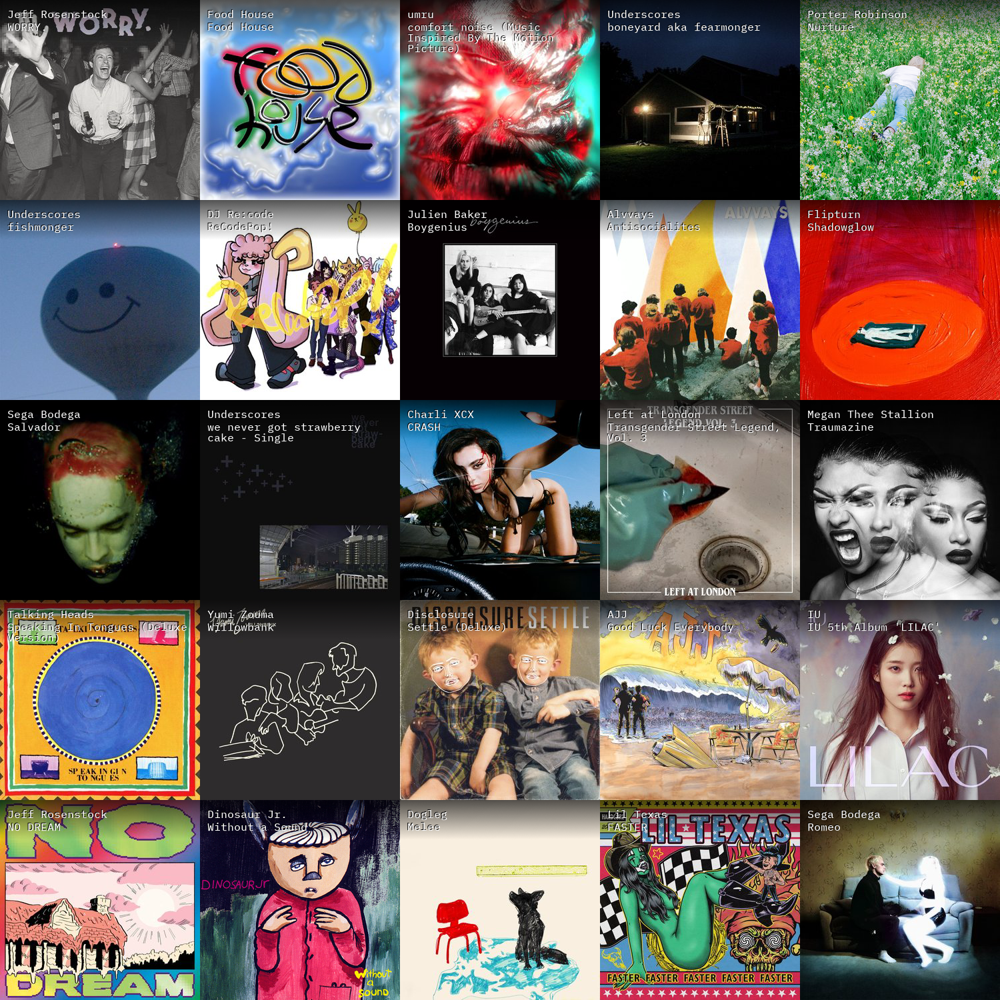

Table of Contents

- [last-fm-collage-generator](#last-fm-collage-generator)
  - [Environment Variables](#environment-variables)
  - [Generating LastFM API keys.](#generating-lastfm-api-keys)
  - [Example Collage](#example-collage)

# last-fm-collage-generator

Tool to generate last-fm collages. This is a personal project - not really meant
to be readable or production ready. Note: This only runs from the root of the repository.

## Environment Variables

See [sample .envrc](.envrc.example).

## Generating LastFM API keys.

See Last.fm's [docs](https://www.last.fm/api#getting-started).

## Example Collage

