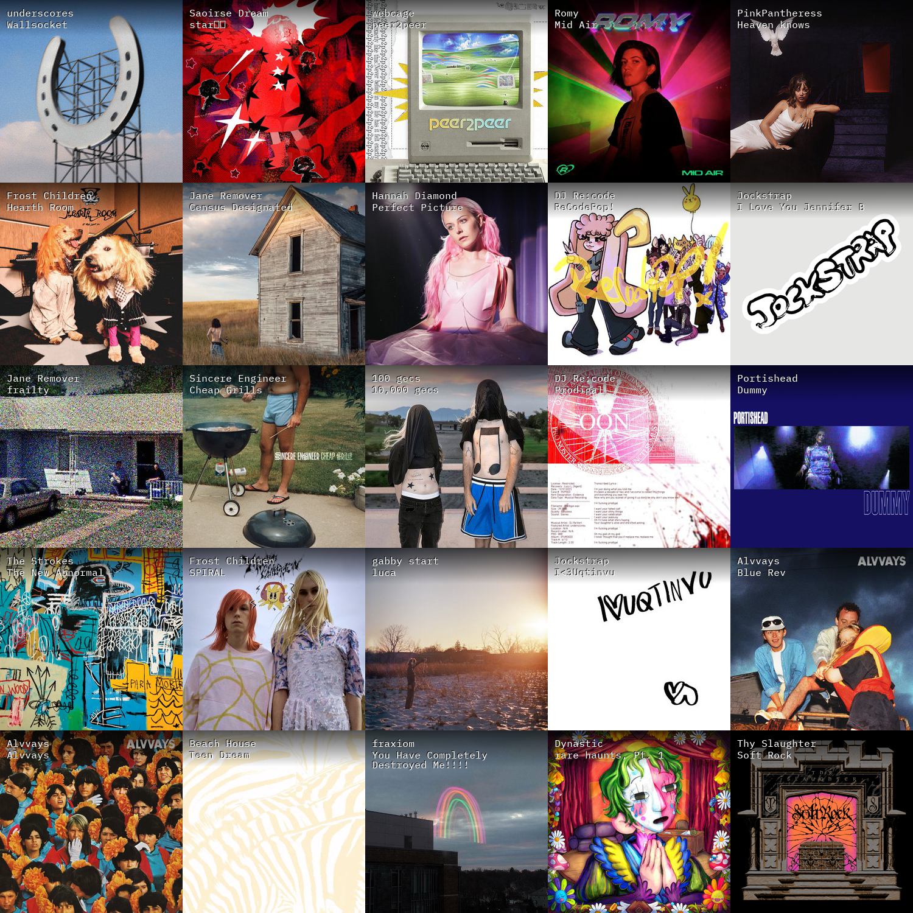

<details>
<summary>
Table of Contents
</summary>

- [last-fm-collage-generator](#last-fm-collage-generator)
  - [Environment Variables](#environment-variables)
  - [Generating LastFM API keys.](#generating-lastfm-api-keys)
  - [Usage](#usage)
  - [Releases](#releases)
  - [Text rendering](#text-rendering)
  - [Example Collage](#example-collage)

</details>

# last-fm-collage-generator

Tool to generate last-fm collages. This is a personal project - not really meant
to be readable or production ready. Note: This only runs from the root of the repository.

## Environment Variables

See [sample .envrc](.envrc.example).

## Generating LastFM API keys.

See Last.fm's [docs](https://www.last.fm/api#getting-started).

## Usage

```text
Usage:
  lastfm-collage-generator [flags]

Flags:
  -h, --help               help for lastfm-collage-generator
  -p, --path string        The path the collage is written to (default "./collage.png")
  -s, --size int           Sets the size x size of the collage (3-10) (default 5)
  -t, --timeframe string   The listening period: 7day, 1month, 3month, 6month, 12month, overall (default "7day")
  -u, --user string        The user to query (default "tashayasha")
  -v, --version            Prints the CLI version
```

For example:

```sh
go build
./lastfm-collage-generator --user tashayasha --timeframe 1month --size 5 --path ./collage.png
```


## Releases

PR titles must follow [Conventional Commits](https://www.conventionalcommits.org/en/v1.0.0/)
(e.g. `fix:` or `feat:`) so [Release Please](https://github.com/googleapis/release-please)
can create a release.

## Text rendering

Labels use IBM Plex Mono with bundled Noto fallbacks for other scripts, symbols,
and emoji. Text wraps to fit each tile and is clipped at its bottom edge.
Unicode coverage is limited; see [font sources and licenses](static/fonts/README.md).

Delete `./generated` after renderer updates to regenerate cached images.

## Example Collage


