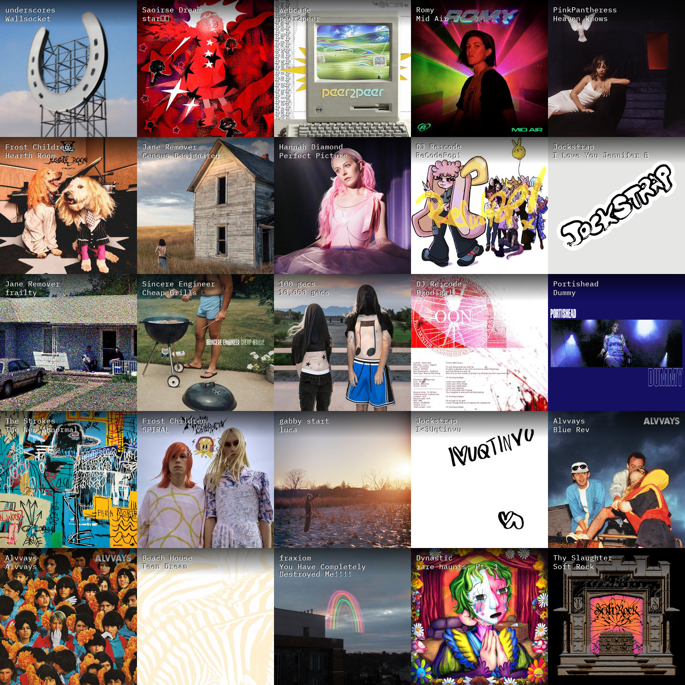

<details>
<summary>
Table of Contents
</summary>

- [last-fm-collage-generator](#last-fm-collage-generator)
  - [Environment Variables](#environment-variables)
  - [Generating LastFM API keys.](#generating-lastfm-api-keys)
  - [Usage](#usage)
  - [Local API server](#local-api-server)
  - [Logging](#logging)
  - [Releases](#releases)
  - [Text rendering](#text-rendering)
  - [Example Collage](#example-collage)

</details>

# last-fm-collage-generator

Tool to generate last-fm collages. This is a personal project - not really meant
to be readable or production ready. Note: This only runs from the root of the repository.

## Environment Variables

See [sample .envrc](.envrc.example).

## Generating LastFM API keys.

See Last.fm's [docs](https://www.last.fm/api#getting-started).

## Usage

```text
Generate a collage of your top Last.fm albums

Usage:
  lastfm-collage-generator [flags]
  lastfm-collage-generator [command]

Available Commands:
  completion  Generate the autocompletion script for the specified shell
  help        Help about any command
  serve       Serve the collage generation API locally

Flags:
  -h, --help               help for lastfm-collage-generator
      --log-level string   Logging verbosity: debug, info, warn, error (default "info")
  -p, --path string        The path the collage is written to (default "./collage.png")
  -s, --size int           Sets the size x size of the collage (3-10) (default 5)
  -t, --timeframe string   The listening period: 7day, 1month, 3month, 6month, 12month, overall (default "7day")
  -u, --user string        The user to query (default "tashayasha")
  -v, --version            Prints the CLI version

Use "lastfm-collage-generator [command] --help" for more information about a command.

```

For example:

```sh
go build
./lastfm-collage-generator --user tashayasha --timeframe 1month --size 5 --path ./collage.png
```


## Local API server

Run from the repository root with your Last.fm credentials loaded:

```sh
source .envrc
go build
./lastfm-collage-generator serve
```

The server listens on `127.0.0.1:8080` by default. Use `serve --listen
127.0.0.1:9000` to choose another address. `API_KEY` must be set at startup.
This initial server is intended for local use and has no authentication.
The existing command without `serve` continues to generate collages as before.

Browse the API documentation at `http://127.0.0.1:8080/v1/docs` or retrieve
its OpenAPI 3.0.3 JSON at `/v1/openapi.json`. Regenerate the checked-in
specification with `go generate ./pkg/server`.

In another terminal, request a PNG:

```sh
curl --fail-with-body 'http://127.0.0.1:8080/v1/generate?user=tashayasha&timeframe=7day&size=5' --output collage.png
```

`GET /v1/generate` requires `user`. Optional `timeframe` defaults to `7day` and
accepts `7day`, `1month`, `3month`, `6month`, `12month`, or `overall`.
Optional `size` defaults to `5` and accepts integers from `3` to `10`.
Unknown, duplicate, empty, or invalid parameters are rejected.

Successful responses contain `image/png` with `Cache-Control: no-store`.
The server does not save finished collages. A partially filled grid has black
empty spaces; no albums produces an error. Missing, undecodable, or failed artwork
downloads produce black tiles with artist and album labels. Cancellation still
stops generation. Artwork uses the same `./generated`
cache as the CLI. If cancellation or overlapping runs damage a cached file,
delete it to regenerate it. Cross-process cache coordination is deferred;
see [the cache decision](docs/adr/0001-local-server-shares-artwork-cache.md).

Only one collage is generated at a time; additional valid requests receive
`503` immediately. Generation has a 60-second deadline. Client disconnects
cancel generation, and Ctrl+C cancels active requests and stops the server
without waiting for them to finish.

Errors use JSON, for example:

```json
{"error":{"code":"invalid_request","message":"user is required"}}
```

- `400 invalid_request`: invalid or missing query parameters.
- `404 user_not_found`: Last.fm reports that the user does not exist.
- `404 not_found`: unknown endpoint.
- `405 method_not_allowed`: unsupported method; use GET.
- `422 no_albums`: no albums in the chosen listening period.
- `500 internal_error`: unexpected generation failure.
- `502 upstream_error`: Last.fm data request failure.
- `503 busy`: another generation is still running.
- `504 timeout`: generation exceeded 60 seconds.

## Logging

Logs use structured text on stderr. The default `info` level shows generation
summaries, individual artwork warnings, and server lifecycle messages.
Credentials are redacted.

Use `--log-level debug` for detailed progress with either the CLI or `serve`.
Supported levels are `debug`, `info`, `warn`, and `error`; higher thresholds
also suppress summaries and startup URLs.

See [application logging](docs/application-logging.md) for fields, severity
conventions, attempt IDs, and credential handling.

## Releases

PR titles must follow [Conventional Commits](https://www.conventionalcommits.org/en/v1.0.0/)
(e.g. `fix:` or `feat:`) so [Release Please](https://github.com/googleapis/release-please)
can create a release.

## Text rendering

Labels use IBM Plex Mono with bundled Noto fallbacks for other scripts, symbols,
and emoji. Text wraps to fit each tile and is clipped at its bottom edge.
Unicode coverage is limited; see [font sources and licenses](static/fonts/README.md).

Delete `./generated` after renderer updates to regenerate cached images.

## Example Collage


