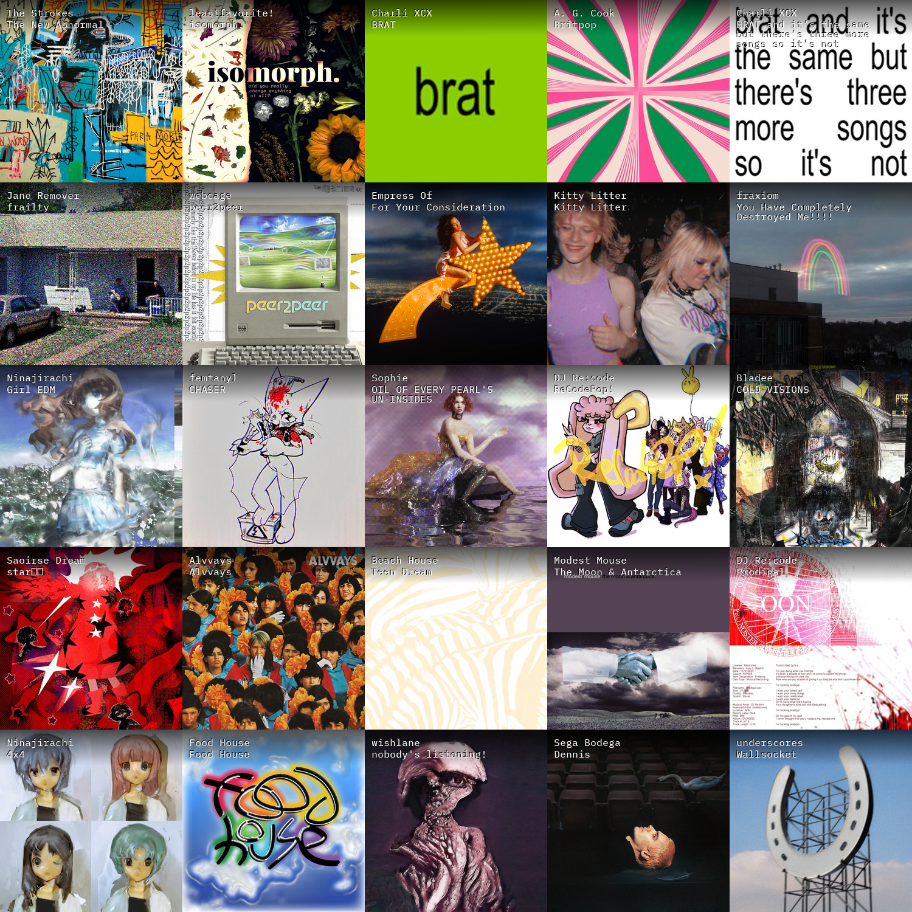

<details>
<summary>
Table of Contents
</summary>

- [last-fm-collage-generator](#last-fm-collage-generator)
  - [Environment Variables](#environment-variables)
  - [Generating LastFM API keys.](#generating-lastfm-api-keys)
  - [Usage](#usage)
  - [Example Collage](#example-collage)

</details>

# last-fm-collage-generator

Tool to generate last-fm collages. This is a personal project - not really meant
to be readable or production ready. Note: This only runs from the root of the repository.

## Environment Variables

See [sample .envrc](.envrc.example).

## Generating LastFM API keys.

See Last.fm's [docs](https://www.last.fm/api#getting-started).

## Usage

```
Usage of ./lastfm-collage-generator:
  -p string
        The path the collage is written to (default "./collage.png")
  -s int
        Sets the size x size of the collage (default 5)
  -t string
        The time frame to generate the collage for.
    
        Available options:
          7day 1month 3month 6month 12month overall (default "7day")
```


## Example Collage


